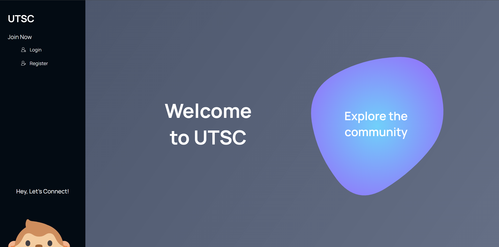
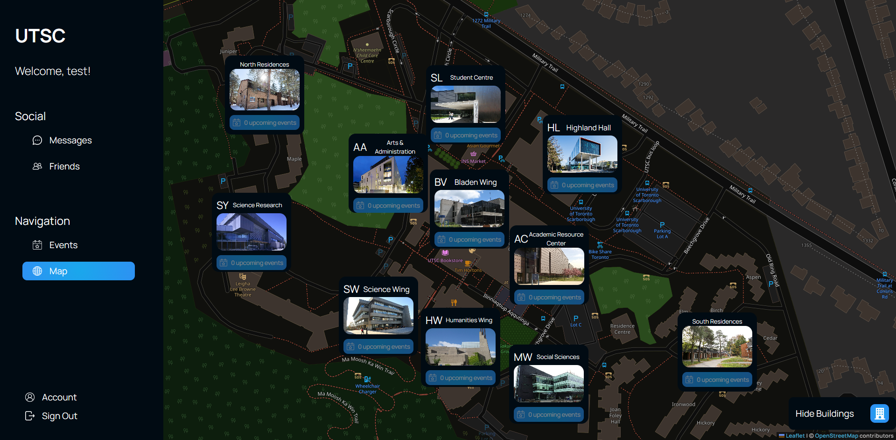
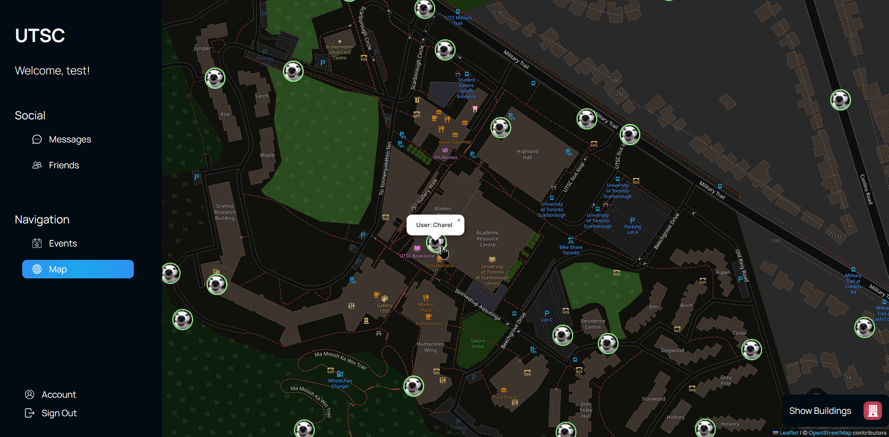

# UTSC Community
A social web app made for students to locate buildings, discover events and groups on campus, meet up with friends on campus, and create group chats.
<figure>
  
  <figcaption>The simple home page.</figcaption>
</figure>

## Design

The frontend is built with Next.js for server-side rendering (using React.js & Typescript) and pure CSS. There is also a separate backend using Node.js, Express.js, and MongoDB for other backend features like the WebSockets for live features.

I completed all the authentication and backend server setup with Node.js/Express.js, and hosted the website on a Google Cloud Platform VPS, with a Cloudflare proxy at ~~https://utscampus.live/~~ (no longer live).

## Map Page

I also implemented the whole map section of the website, using Leaflet and OpenStreetMap to help users locate buildings.
<figure>
  
  <figcaption>The custom map page, with popups for each building on campus.</figcaption>
</figure>

The map also integrates with the events page to show where a campus event is taking place.
<figure>
  
  <figcaption>When an event is focused, the map pans to the event's building. </figcaption>
</figure>

## Friend Locations

In the map page, I also implmented the feature to share your location with friends.

When a user adds some friends and their friends have allowed sharing their location, it will show their live location through a WebSocket connection.

<figure>
  
  <figcaption>The map showing all the user's friends in green circles, indicating their live location on campus.</figcaption>
</figure>